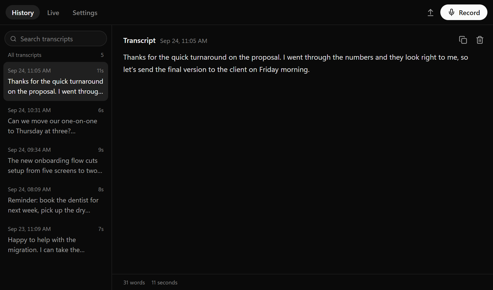
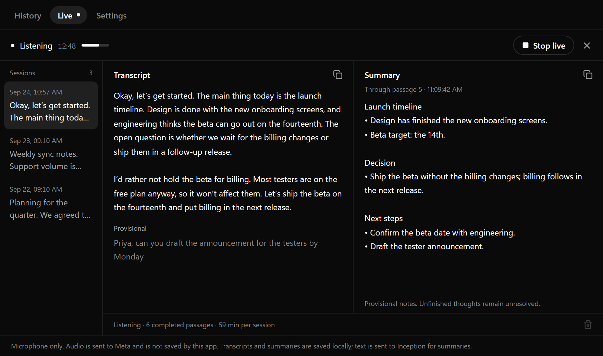

<div align="center">


# Transcribe

**Speak instead of typing.** Press a shortcut, talk, and clean text lands in whatever app you're using.

[](https://github.com/awidor/Transcribe/releases/latest)
[](#install)

**[Download the latest release](https://github.com/awidor/Transcribe/releases/latest)**

<br>


</div>

## Why Transcribe

- **Works in any app.** A small pill floats over your screen while you talk. When you stop, the text is pasted where your cursor is.
- **Cleans up what you say.** Filler words, stutters, and false starts disappear and punctuation is fixed, while your wording stays your own.
- **Nothing gets lost.** Every dictation is saved to History, where you can search, edit, and copy it. If a paste fails, the pill holds on to the text so you can drag it where it belongs.
- **Changed your mind?** Press `Esc` while dictating to cancel and discard it.
- **Live notes for meetings.** Follow a live transcript while a summary of key points, decisions, and next steps builds up beside it.
- **Import recordings.** Transcribe WAV, MP3, and FLAC files.
- **Stays up to date.** New versions install from Settings in one click.





## Install

Download the installer for your platform from the [latest release](https://github.com/awidor/Transcribe/releases/latest).

| Platform                  | Download                                                                   |
| ------------------------- | -------------------------------------------------------------------------- |
| Windows (x64)             | `Transcribe_<version>_x64-setup.exe`, or the `.msi` for managed installs   |
| macOS 12+ (Apple Silicon) | `Transcribe_<version>_aarch64.dmg`, then drag Transcribe into Applications |
| Linux                     | No release build yet. See [Build from source](#build-from-source).         |

SHA-256 checksums for every download are in `SHA256SUMS.txt` on the release page.

> [!NOTE]
> The installers aren't signed with a publisher certificate, so your system asks before running them the first time.
>
> - **Windows:** when SmartScreen appears, choose **More info**, then **Run anyway**.
> - **macOS:** if Transcribe won't open, choose **Open Anyway** in System Settings > Privacy & Security.

## Get started

1. Open **Settings** and add an [OpenRouter API key](https://openrouter.ai/keys).
2. On macOS, allow microphone, Accessibility, and Input Monitoring access when asked.
3. Click into any text field, press the shortcut, and start talking. Press it again to stop, and the text is pasted in.

|                         | Windows and Linux      | macOS                 |
| ----------------------- | ---------------------- | --------------------- |
| Start or stop dictation | `Ctrl` `Shift` `Space` | `Cmd` `Shift` `Space` |
| Cancel and discard      | `Esc`                  | `Esc`                 |

Record a different shortcut in Settings. A dictation stops on its own after five minutes.

### Live notes

Live notes use two more keys, both added in Settings: a Meta key for live transcription and an Inception key for summaries. Open the **Live** tab and choose **Start live**. A session runs for up to 59 minutes.

### Cleanup on your own machine

Cleanup runs through OpenRouter with the model you choose. You can instead download **S1-mini by Superwhisper** in Settings to clean up transcripts locally, with a style from casual to formal.

### Updates

Transcribe checks for new versions in the background. When one is ready, Settings shows it with an **Install and restart** button.

## Privacy

Transcribe has no account and no server of its own. Besides the services you add keys for, it only contacts GitHub to check for updates, and Hugging Face and GitHub if you download S1-mini.

| What                               | Where it goes                                             |
| ---------------------------------- | --------------------------------------------------------- |
| Dictation and imported audio       | OpenRouter, for transcription                             |
| Dictation transcripts              | OpenRouter for cleanup, or nowhere with S1-mini           |
| Live microphone audio              | Meta, for live transcription. Transcribe doesn't save it. |
| Live transcripts and earlier notes | Inception, for summaries                                  |

History, live notes, and API keys stay on your computer. API keys are stored as plain text, not in the system keychain.

## Troubleshooting

- **The shortcut or pasting stops working on macOS after an update.** Remove Transcribe from Accessibility and Input Monitoring in System Settings, then add it again.

---

## Development

This part is for working on Transcribe itself. To use it, [install a release](#install).

Transcribe is a [Tauri 2](https://tauri.app) app with a React and TypeScript interface and a Rust core.

### Requirements

- Node.js 24 and stable Rust.
- macOS: Xcode command-line tools.
- Ubuntu or Debian: the native libraries below.

```sh
sudo apt-get install build-essential pkg-config libasound2-dev libdbus-1-dev \
  libgtk-3-dev libgtk-layer-shell-dev libwebkit2gtk-4.1-dev \
  libayatana-appindicator3-dev librsvg2-dev
```

### Build from source

```sh
git clone https://github.com/awidor/Transcribe.git
cd Transcribe
npm ci
npm run desktop
```

`npm run desktop` starts the app with live reload.

### Test

```sh
npm test
npm run check
cargo test --workspace --locked
```

### Package

```sh
npm run package
```

Installers are written to `target/release/bundle/`.

On macOS, `npm run package -- --bundles app` followed by `npm run install:macos` signs the build and installs it into Applications. If permissions stop working after re-signing, remove and re-add the app in System Settings.

### Release

Bump the version in `package.json`, `package-lock.json`, `src-tauri/tauri.conf.json`, both `Cargo.toml` files, and `Cargo.lock`, then push a matching tag such as `v0.1.6`. GitHub Actions checks every platform, builds the Windows and macOS installers with update signatures, and drafts the release. Publishing the draft makes it available to installed copies.
